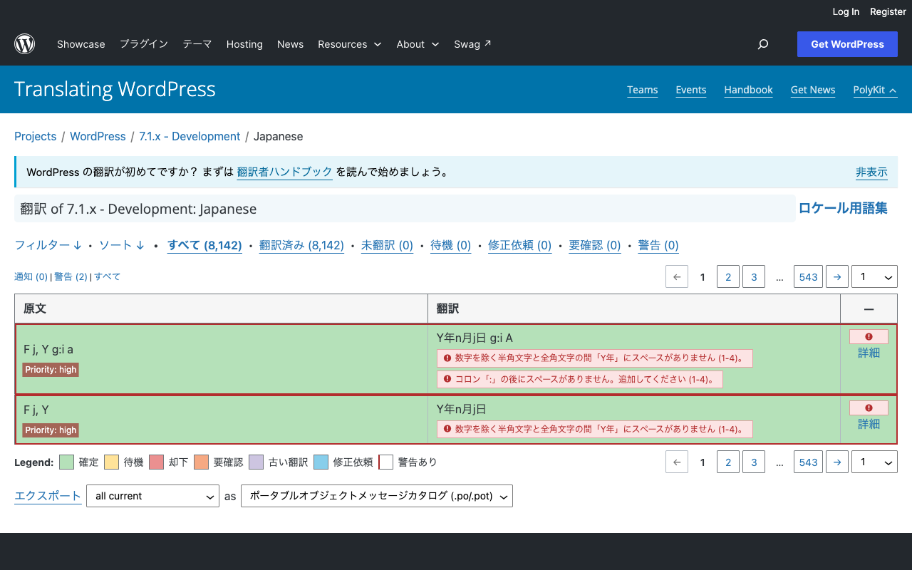
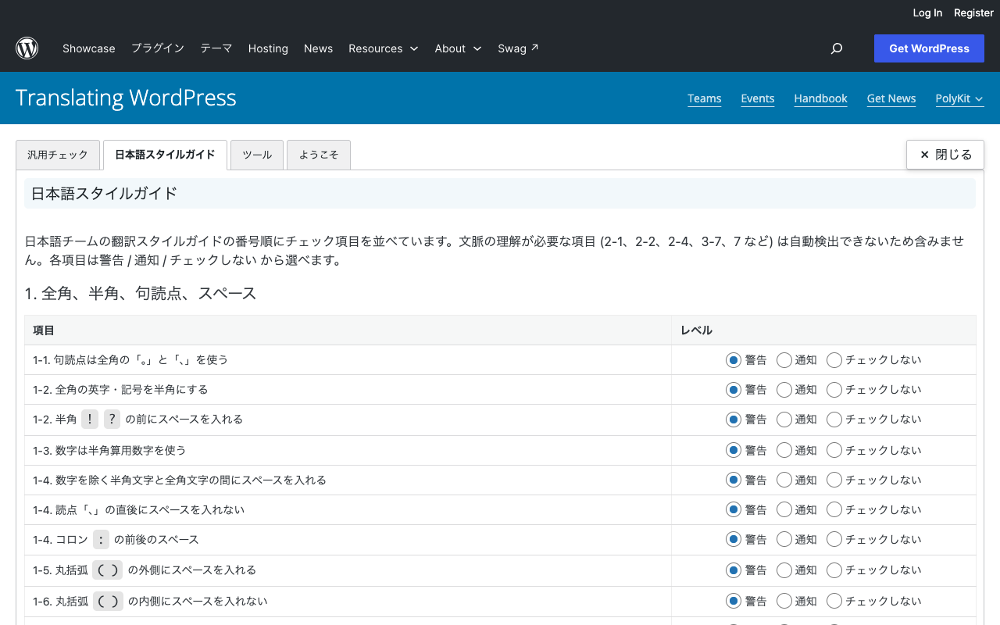

# PolyKit

PolyKit は、[translate.wordpress.org][] で WordPress の日本語訳を作成・レビューする人のためのブラウザー拡張機能です。翻訳画面にチェック結果や用語の情報、レビュー用の操作を追加します。翻訳を自動で作るツールではありません。

[GlotDict][] を基に、日本語コミュニティの翻訳作業向けに再構成しています。

## できること

主な機能と使う場面は次のとおりです。表示される操作は、利用者の権限や設定によって異なります。

| 機能 | 使う場面 |
| --- | --- |
| 日本語の表記と原文との差をチェック | 訳文の入力中や保存前に、空白・訳語・プレースホルダーを確認する |
| 用語集と既存訳を参照 | 訳語に迷ったとき、すでに使われている訳と揃える |
| レビューと一括操作を補助 | 複数の訳を確認し、権限に応じて承認や置換を進める |
| 文字数や補助リンクを表示 | 翻訳画面で必要な情報にすばやくアクセスする |

### 日本語スタイルガイドのチェック

翻訳を入力しているときと、保存する前に、日本語スタイルガイドに沿っているか確認します。

- 句読点が「。」「、」になっているか、英数字や記号が半角になっているかを見ます。全角スペースや全角数字も指摘します。
- 半角と全角のあいだ、コロンの前後、丸括弧の内外に、スペースが適切についているかを確認します。読点の直後や、半角数字の前後にある余分なスペースも知らせます。
- 閉じ括弧の直前に「。」があるときや、日本語の引用に `"` や `“”` が使われているときに知らせます。
- 「下さい」「全て」「既に」は「ください」「すべて」「すでに」に、「ユーザ」「サーバ」などは「ユーザー」「サーバー」にするよう知らせます。
- "View XX" が「XX を表示」に、"not allowed to" が「権限がありません」になっているかを確認します。"Sorry, …" の謝罪が訳に残っているときも指摘します。
- 「〜されました」や「あなた」、カタカナ語をつなぐ中点、「ワードプレス」や表記の違う WordPress も指摘します。

### 原文との比較

- プレースホルダーの数、種類、並び順が原文と合っているかを確認します。
- 連続したスペース、タグの前後のスペース、文頭と文末のスペースを原文と比べます。
- `...` が三点リーダー「…」になっているか、文末の記号が原文と揃っているかを確認します。
- 用語集の推奨訳が、訳文に入っているかを確認します。
- 保存を止めたい単語や、原文と出現回数を揃えたい単語を、自分で登録できます。

### チェックの結果と保存

- 項目ごとに、警告、通知、チェックしない、から選べます。
- 警告が出ている訳は、保存をいったん止めます。「警告付きで保存 / 承認」にチェックを入れると、警告があっても保存できます。通知が出ているときも止めるように設定できます。
- 「レビュー」ボタンで、表示中の訳をまとめて確認できます。警告と通知がいくつあるかも分かります。
- 一覧の各行に結果を表示します。警告がある行だけ、通知がある行だけ、に絞って見ることもできます。

### 用語集と既存の訳

- 原文についている用語から、その語の Consistency を開けます。用語を右クリックすると、推奨訳を訳文の末尾に追加します。
- 編集中の原文について、すでに使われている訳を候補として表示し、コピーできます。訳が分かれているときは、その件数を表示します。
- 各行から、その翻訳のパーマリンク、履歴、Consistency、ディスカッションを開けます。
- 開いているプロジェクトに加え、WordPress 本体やほかのプラグインもまとめて検索できます。Google 翻訳を開くボタンも付けられます。

### レビューと一括操作

- 各行に、承認、却下、要確認のボタンを付けます。
- 選択中の行について、現在、待機、要確認、古い翻訳、却下、未翻訳、警告あり、の件数を表示します。
- 選んだ行に、原文をまとめてコピーできます。コピーしたあと自動で保存する設定もあります。
- GTE は、Consistency で選んだ訳に、最大 25 件までまとめて置き換えて保存できます。選んだ行をまとめて却下することもできます。

### 翻訳画面の補助

- 原文、保存済みの訳、入力中の訳について、文字数を表示します。参考として語数も出します。
- UTC で表示されている日時を、自分のタイムゾーンに換算して表示します。訳文中のノンブレークスペースには色を付けます。
- ヘッダーを画面の上部に固定できます。先頭へ戻るボタンと、ページ番号を選んで移動できるページ送りも追加します。
- 投稿者で絞り込むときに、匿名の投稿者を選べます。トップページでは日本語を一覧の先頭に出し、統計やプロジェクトのページでは日本語の行へ移動できます。
- 編集画面を開いたときに原文をクリップボードへコピーできます。保存していないままページを離れようとすると、確認を出せます。
- 絞り込みバーに、翻訳ハンドブック、スタイルガイド、用語集へのリンクを追加します。

### 画面の日本語化と設定

- GlotPress のボタンやラベルと、PolyKit の表示を日本語にできます。
- ツールバーの PolyKit アイコンから、日本語表示の切り替えと、設定画面を開けます。
- Chrome 同期が有効で、同じ拡張機能 ID の PolyKit を使っている場合は、同じアカウントの Chrome 間で設定を同期できます。別の人へ渡す場合は、ツールバーの PolyKit アイコンから設定を JSON ファイルに書き出し、相手側で読み込みます。同期された設定は翻訳ページの次回読み込み時に反映されます。
- GTE は、スタイルガイドのリンク先を変える HTML を作れます。ロケール用語集の説明欄に貼り付けて使います。

## 動作環境と注意点

- Chrome（Manifest V3）または Firefox で、[translate.wordpress.org][] のページを開いたときに動作します。WordPress Playground のページは対象外です。
- 翻訳の保存や承認には、サイト上で該当する権限が必要です。PolyKit はサイトの権限を変更しません。
- GlotDict との同時利用はサポートしていません。画面に追加する機能が重なるため、PolyKit を使うときは GlotDict を無効にしてください。

## インストール

[Releases][] から使用するブラウザー向けのファイルをダウンロードします。

### Chrome

1. `PolyKit_vX.Y.Z.zip` を展開します。
2. アドレスバーに `chrome://extensions/` と入力して開き、デベロッパーモードを有効にします。
3. 「パッケージ化されていない拡張機能を読み込む」を選び、展開したフォルダーを指定します。

### Firefox

1. アドレスバーに `about:debugging` と入力して開きます。
2. 「この Firefox」から「一時的なアドオンを読み込む」を選び、`PolyKit_vX.Y.Z.xpi` を指定します。

この方法で読み込んだ Firefox のアドオンは一時的なものです。ブラウザーを再起動した後は、必要に応じて読み込み直してください。

## 使い始める

1. 拡張機能を読み込んだ状態で、[translate.wordpress.org][] の翻訳一覧を開きます。
2. 必要ならツールバーの PolyKit アイコンから「UI を日本語に翻訳」を切り替えます。「設定を開く」から、チェック項目や表示の設定も変更できます。
3. 翻訳行を開いて訳文を入力します。表示されるチェック結果、文字数、用語集や既存訳の候補を確認してください。
4. 警告があれば内容を確認して訳文を直します。そのうえで保存します。警告を残して保存する必要がある場合は、保存時の「警告付きで保存 / 承認」を選びます。
5. 複数の訳を見直すときは、翻訳一覧の「レビュー」ボタンを使います。承認・却下・要確認の操作は、サイト上の権限に応じて利用できます。

日本語の翻訳ルールについては、翻訳画面から開ける翻訳ハンドブック、スタイルガイド、用語集も参照してください。自動チェックだけでは文脈に合った訳かどうかは判断できません。

## 画面イメージ

翻訳一覧では、警告がある行を絞り込み、指摘された内容を確認できます。



設定画面では、日本語スタイルガイドのチェック項目ごとに重要度を選べます。



画像は公開中の翻訳サイトをログアウト状態で表示して撮影したものです。保存や承認は行っていません。

## 開発時の確認

依存関係の取得とテストには [Deno][] を使います。

```sh
deno task check
```

このコマンドは整形、JavaScript の構文、辞書、回帰テストを確認します。パッケージを手元で作る場合は、次を実行します。

```sh
deno task pack
```

Chrome 用の ZIP と Firefox 用の XPI がリポジトリ直下にできます。

ブラウザー上の表示と操作は、次のローカルページでも確認できます。

```sh
python3 -m http.server 8766 --bind 127.0.0.1
```

<http://127.0.0.1:8766/tests/browser-smoke.html> を開いてください。このページでは保存や承認は行わないため、実サイトでの動作確認は別途必要です。

### リリース

`manifest.json` の `version` に `v` を付けたタグ（例: `v1.0.1`）を push すると、GitHub Actions が Release を作成します。添付されるファイルは `PolyKit_vX.Y.Z.zip` と `PolyKit_vX.Y.Z.xpi` です。

## ドキュメント

- [システム全体の設計](docs/architecture.md)
- [ポップアップと画面翻訳設定の設計](docs/popup-and-interface-translation-design.md)

## ライセンス

[GPL-2.0](LICENSE) です。GlotDict 由来のコードを含みます（[GlotDict][]）。

[translate.wordpress.org]: https://translate.wordpress.org/
[GlotDict]: https://github.com/Mte90/GlotDict
[Releases]: https://github.com/hiroshisatoy/polykit/releases
[Deno]: https://deno.land/
